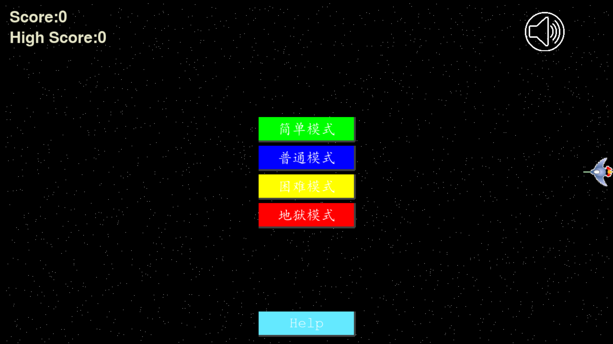

# Aircraft Battle


一个由Python、Pygame和pywin32开发的飞机大战游戏,完全原创,图片来源与网络。

## 下载模块

要在 macOS 或 Linux 上使用 pip 进行安装，请运行:
```
pip3 install --user pygame
pip3 install --user pywin32
```

要在 Windows 上使用 pip 进行安装，请运行:
```
py -m pip install --user pygame
py -m pip install --user pywin32
```
## 快速入门指南

首先需要安装Python并根据上一个章节安装第三方库
接着，您需要打开终端，输入以下指令：
```
py .\Aircraft Battle\src\main.py
```
请将.替换为Aircraft Battle目录的父目录
然后就可以看见如图窗口：

单击Help按钮查看游戏玩法说明

## 贡献
如果您想为飞机大战做出贡献，请查看 https://github.com/nanocode38/Aircraft-Battle
